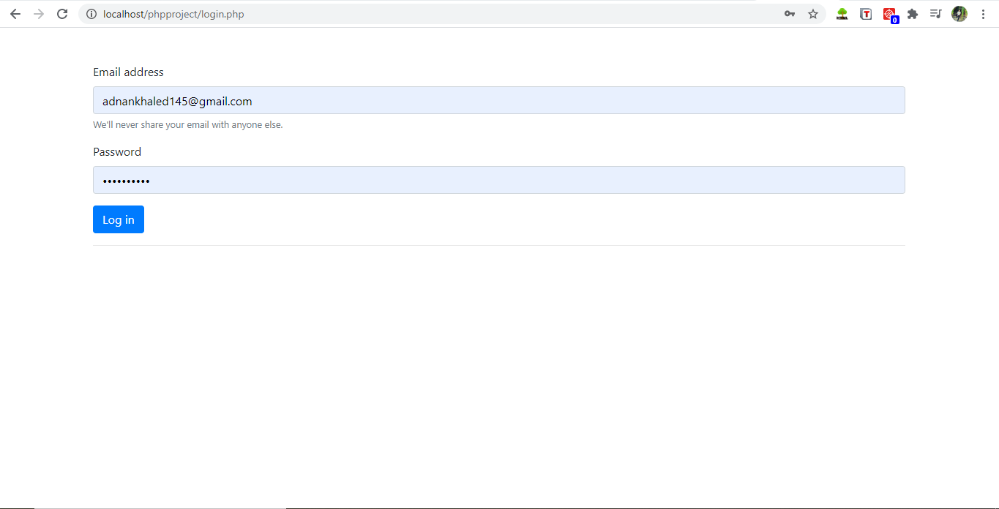
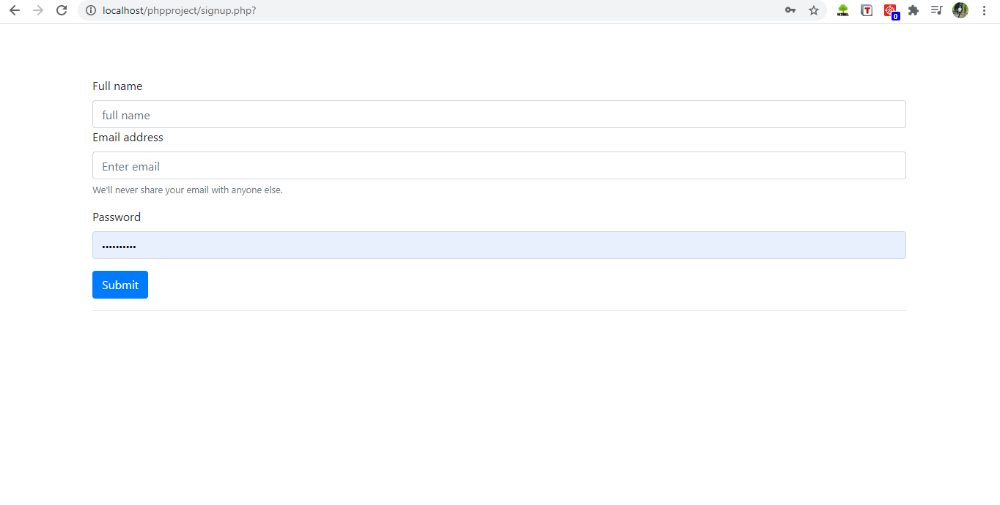
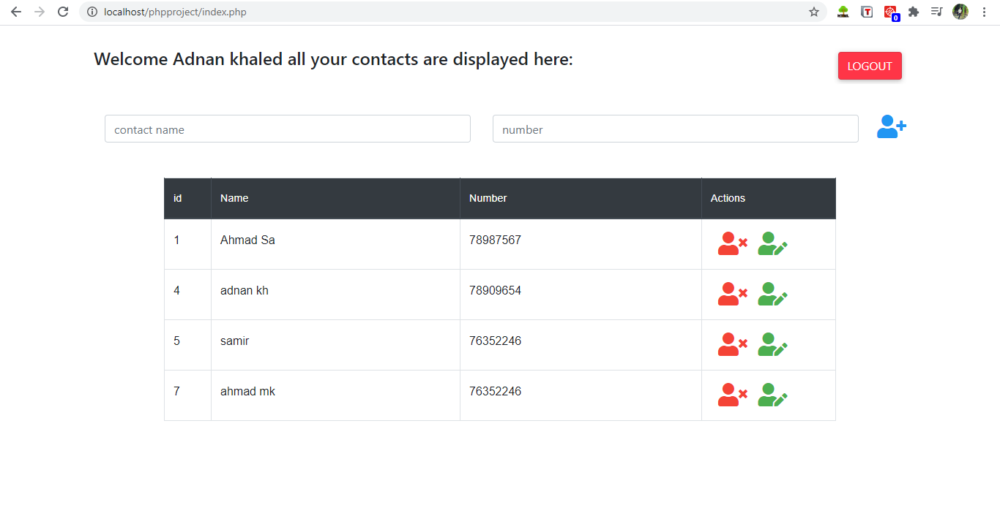
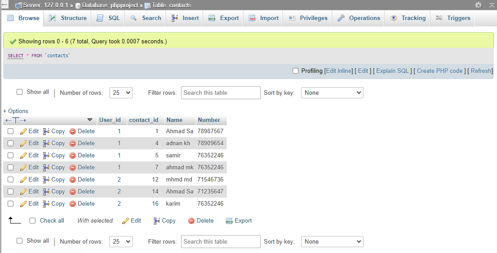

# contact
<b> Create your own user and Add your contacts </b> 

login page :

<b> login to your account </b>

sign up page:

<b> if you dont have an account in the database you can signup </b>

after signing in:

<b> Displays your contanct list where you can add/delete/update contancts </b>

edit contact :

database:

